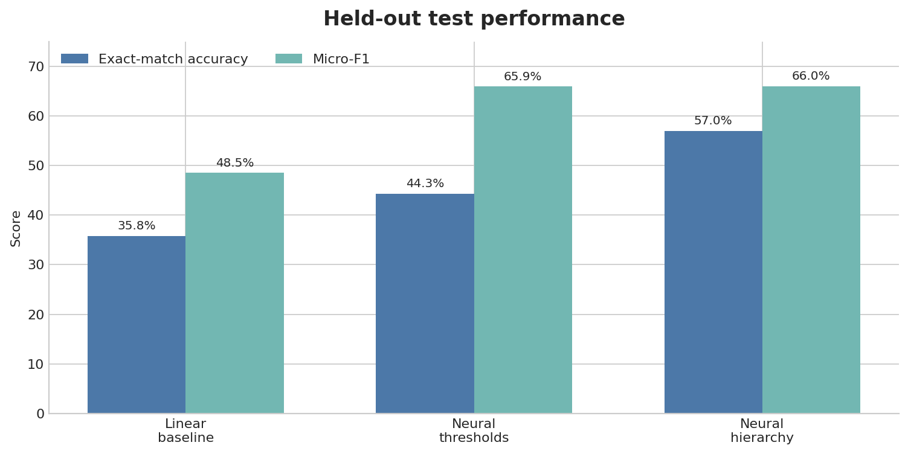
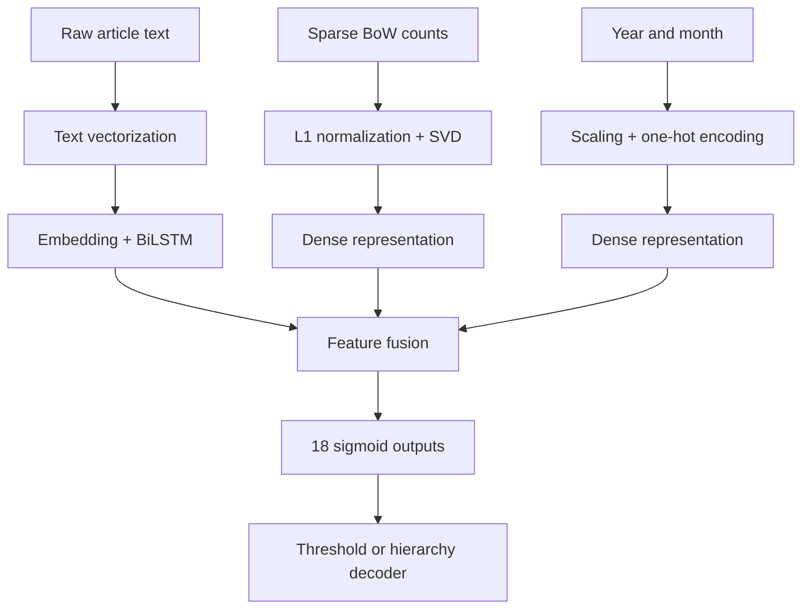

# Multimodal Hierarchical News Classification

[](https://www.python.org/)
[](https://www.tensorflow.org/)
[](#testing)
[](https://colab.research.google.com/github/Vittoriacrugnolaa/University_projects/blob/main/Multimodal_News_Classification/notebooks/multimodal_news_classification.ipynb)

A reproducible deep-learning pipeline for hierarchical multi-label news classification. The model combines raw article text, a sparse Bag-of-Words representation, and publication metadata in a three-branch neural network.

## Results

The final evaluation uses a held-out test set of 1,650 articles. Preprocessing, early stopping, and decision thresholds are fitted without test leakage.



| Method | Exact-match accuracy | Micro-F1 | Macro-F1 | Hamming loss |
| --- | ---: | ---: | ---: | ---: |
| Linear baseline | 0.358 | 0.485 | 0.424 | 0.134 |
| Neural network, tuned thresholds | 0.443 | 0.659 | **0.625** | 0.086 |
| Neural network, hierarchy decoder | **0.570** | **0.660** | 0.616 | **0.085** |

The neural model improves micro-F1 by about 17 percentage points over the linear baseline. The hierarchy-consistent decoder raises exact-match accuracy from 44.3% to 57.0% by preventing impossible label combinations.

## Architecture



The model has approximately 1.42 million trainable parameters. The BoW matrix is only 0.22% non-zero, so it remains sparse until Truncated SVD compresses its 10,000 columns to 256 components. This removes the original dense-memory bottleneck while retaining 52% of the variance.

## Methodology

- **Iterative multi-label stratification** creates 70/15/15 train, validation, and test splits with identical marginal label prevalence.
- **Train-only preprocessing** prevents vocabulary, SVD, scaling, and encoding leakage.
- **Linear baseline** makes the value of the neural architecture measurable.
- **Validation-only threshold tuning** improves imbalanced per-label decisions.
- **Hierarchy-consistent decoding** restricts predictions to the 11 valid target paths observed in training.
- **Explicit metrics** distinguish exact-match accuracy, Hamming loss, micro-F1, macro-F1, precision, and recall.
- **Reproducible artifacts** save the text vectorizer inside the Keras model and the remaining preprocessors with Joblib.

## Dataset

The validated archive contains:

| Input | Shape | Processing |
| --- | ---: | --- |
| Article text | 11,000 strings | TextVectorization, embedding, bidirectional LSTM |
| Bag-of-Words | 11,000 × 10,000 | Sparse L1 normalization and Truncated SVD |
| Year and month | 11,000 × 2 | Standard scaling and one-hot encoding |
| Hierarchical targets | 11,000 × 18 | Multi-label binary matrix |

The archive is excluded from Git because its third-party article text was supplied without a redistribution license. Place the original `input_data.zip` in `data/`, or upload it when Colab prompts. The loader verifies the exact SHA-256 checksum before deserializing the pickle; see [data/README.md](data/README.md).

The target file contains label indices but no human-readable taxonomy names, so reports deliberately use `label_0` through `label_17` rather than inventing category names.

## Run in Google Colab

Open the notebook with the badge at the top of this page. Colab clones the repository, installs the one missing lightweight dependency, and prompts for `input_data.zip`. A GPU is optional; the full training run completed in about one minute on the test CPU used for this repository.

## Run locally

```bash
git clone https://github.com/Vittoriacrugnolaa/University_projects.git
cd University_projects/Multimodal_News_Classification
python -m venv .venv
source .venv/bin/activate  # Windows: .venv\Scripts\activate
python -m pip install -e ".[dev]"
```

Place the dataset at `data/input_data.zip`, then open:

```text
notebooks/multimodal_news_classification.ipynb
```

The supported Python range is 3.10–3.12.

## Project structure

```text
Multimodal_News_Classification/
├── assets/                         # README result visual
├── data/README.md                  # dataset schema and checksum
├── notebooks/
│   └── multimodal_news_classification.ipynb
├── src/news_classifier/
│   ├── data.py                     # secure loading, validation, splits, preprocessing
│   ├── evaluation.py               # thresholds, hierarchy decoder, metrics
│   └── model.py                    # TensorFlow model and training callbacks
├── tests/                          # fast unit tests with synthetic data
├── pyproject.toml
└── requirements.txt
```

## Testing

```bash
python -m pytest
```

The tests cover archive validation, multi-label splitting, threshold tuning, metric calculation, and valid-pattern decoding.

## Reproducibility notes

The project fixes Python, NumPy, and TensorFlow seeds and requests deterministic TensorFlow operations when supported. Small numerical differences can still occur across hardware, TensorFlow builds, and low-level linear algebra libraries.

The original dataset does not include the external vocabulary used to build its 10,000 BoW columns. New-article inference therefore requires a BoW vector generated with that same vocabulary; the notebook's inference helper makes this contract explicit.

## Author

[Vittoria Crugnola](https://github.com/Vittoriacrugnolaa)
